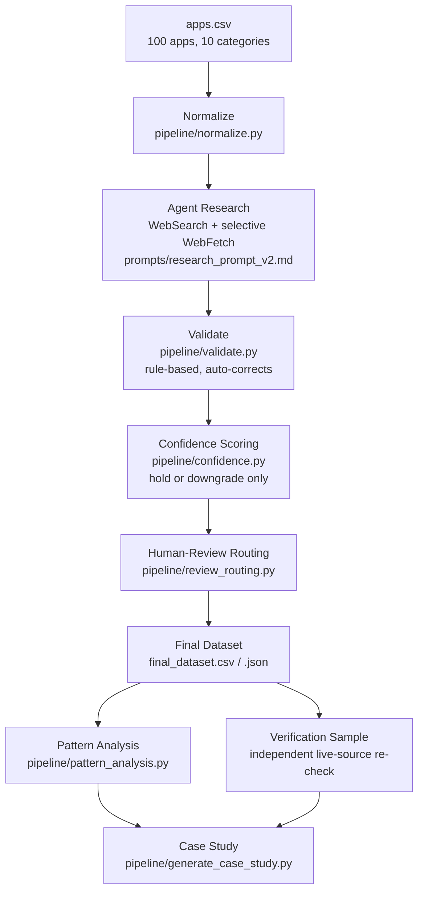

# App Integration Research Agent

## 1. Executive Summary

This is a take-home submission for the Composio AI Product Operations Intern role. The objective was to build a reusable, inspectable research pipeline -- not a one-off manual writeup -- that determines whether real-world apps can become agent-callable Composio toolkits, and to run it across the provided 100-app / 10-category dataset.

What was built: an agent-driven research stage (finds official documentation, classifies auth/access/API/MCP status against controlled vocabularies) feeding a fully deterministic downstream pipeline (rule-based validation, confidence scoring, human-review routing, pattern analysis, HTML case-study generation). The research stage was iterated once: a 5-app deep pilot (V1) surfaced 4 concrete problems, each fixed in the schema and procedure before the remaining 95 apps were researched (V2).

Primary outcome: 100/100 apps researched and classified. 66 are buildability-READY today, 12 need a setup step, 5 are gated behind sales/partnership, and 17 need human review. A 14-field independent verification sample measured 92.9% accuracy (13/14 correct) against live sources and caught one real classification error before this dataset was finalized. Full detail below.

## 2. Problem Statement

Manually researching integration readiness for 100 apps -- finding the real developer docs, reading past marketing copy to the actual auth/access mechanics, checking whether an MCP server exists and whether it's actually official -- is slow, inconsistent across researchers, and leaves no audit trail. It also invites two specific failure modes this project treats as first-class risks: quietly guessing when evidence is thin, and treating "an API exists" as the same thing as "an agent can safely call it today." A pipeline forces every classification to carry evidence, forces uncertainty to stay visible instead of being smoothed over, and can be rerun against a different app list without redoing the design work.

## 3. What the Agent Researches

For each app, six things, each backed by evidence:

- **Auth** -- how a developer authenticates (OAuth2, API key, token, basic, or none found), from `AUTH_METHODS`.
- **Access** -- whether API access is self-serve, trial, paid, admin-gated, partner-gated, or requires a sales conversation, from `ACCESS_MODEL`.
- **API** -- what programmatic surface exists (REST, GraphQL, RPC, SOAP, SDK-only, CLI, or none) and how broad it is, from `API_TYPES` / `API_BREADTH`.
- **MCP** -- whether an official or community MCP server exists, from `MCP_STATUS`, with a hard rule: never classify `OFFICIAL` unless evidence is actually on the vendor's own domain.
- **Buildability** -- a defensible verdict (`READY` / `FEASIBLE_WITH_SETUP` / `GATED` / `BLOCKED` / `NEEDS_REVIEW`) that has to be internally consistent with the four fields above, or the pipeline overrides it.
- **Confidence** -- HIGH/MEDIUM/LOW, which the pipeline can only hold or downgrade from what the agent claimed, never upgrade.

Every substantive claim also carries an **evidence object**: the source URL(s), whether the source is official or third-party, and whether the content was actually read (`verified: true`) versus inferred from a domain match or search snippet (`verified: false`). That `verified` bit is what lets the pipeline distinguish "confirmed" from "probably true" instead of collapsing both into one confident-looking record.

## 4. Agent Architecture



Everything from Normalize onward is deterministic Python with zero network calls -- rerun any of it against the same `research/v2_raw/*.json` files and you get byte-identical output (see Section 11 and `tests/test_pipeline.py::TestRunPipelineIntegration::test_pipeline_reruns_deterministically`, which asserts this directly). Only Research is non-deterministic, because it requires live web access and judgment calls about source quality.

This is deliberately a single-agent pipeline, not a multi-agent system. The hard part of this assignment is evidence discipline and honest uncertainty, not task orchestration -- adding agent-to-agent handoffs would add failure surface without adding rigor.

## 5. Research Methodology

Research was executed by an LLM agent (Claude) operating inside an interactive session with web search and page-fetch tools, following the written procedures in `prompts/research_prompt_v1.md` and `prompts/research_prompt_v2.md` -- **not** a standalone script calling an API autonomously. This was an explicit tradeoff: it means no API key has to be issued, stored, or shipped with this repository, and the research step can be inspected and corrected as it runs, at the cost of "rerun the research" meaning "open a session against this repo and have the agent follow the prompt," not "run a cron job." The prompt files are written precisely enough that this is a faithful re-execution of a documented method, not improvisation -- this is documented honestly rather than implying an unattended API pipeline that doesn't exist.

**V2 intentionally reduced per-app research depth to reach 100-app coverage.** V1 used 3-4 tool calls per app (near-exhaustive fetching). V2 targets 1-2 targeted searches per app (one combined auth/access/API query, one MCP-specific query), with page fetches reserved for ambiguous or high-stakes classifications. That tradeoff is not hidden -- it is the direct, disclosed cause of the 90% human-review rate (Section 9) and the reason a verification stage (Section 9 / `docs/verification.md`) exists at all.

## 6. V1 → V2 Iteration

V1 researched 5 apps (Stripe, Salesforce, Notion, Sherlock, WhatsApp Business -- one per category) at maximum depth, then was self-inspected for problems before any pipeline code was scaled up. Four concrete issues were found and fixed:

| # | V1 problem | V2 fix |
|---|---|---|
| 1 | Evidence-verification conflation -- a login-gated page on an official domain (WhatsApp Business's MCP docs) was treated the same as a page actually read and confirmed | Added `verified: bool` to every evidence object + a `SOURCE_NOT_VERIFIED` flag the pipeline raises automatically |
| 2 | Plan-dependent access (Notion, Salesforce) hidden in free-text notes, no structured field | Added `access_conditional_gate: bool` + `CONDITIONAL_ACCESS` flag |
| 3 | Vocabulary gap -- Salesforce's SOAP API had no slot in `API_TYPES`, got mistagged as `SDK_ONLY` | Added `SOAP` to `API_TYPES` |
| 4 | No flag for apps with no vendor/account concept at all (Sherlock, a local CLI tool) | Added `NON_STANDARD_INTEGRATION_MODEL` heuristic flag |

Full detail in `docs/v1_findings.md`.

## 7. Output Schema

Defined once in `pipeline/schema.py` and used everywhere downstream. Key fields per app:

- `app`, `category`, `description`
- `auth_methods` (list) + `auth_evidence` (`{urls, source_type, verified}`)
- `access_model`, `access_notes`, `access_conditional_gate` (bool) + `access_evidence`
- `api_types` (list), `api_breadth`, `api_notes` + `api_evidence`
- `mcp_status` + `mcp_evidence`
- `buildability`, `main_blocker`
- `confidence` (agent's self-report) and `final_confidence` (pipeline's recomputed value)
- `needs_human_review` (bool, set by the pipeline, not the agent)
- `review_flags` (list, from a fixed vocabulary -- see `REVIEW_FLAGS` in `pipeline/schema.py`)
- `sources` (all URLs cited), `pipeline_version`, `research_date`

## 8. Key Findings

Canonical numbers only, read from `data/output/v2/patterns.json` (also mirrored at `data/output/patterns.json`):

- **66/100 apps are buildability-READY.** 79% offer self-serve access, but self-serve alone isn't sufficient -- a confirmed auth path and a real API surface both have to hold too.
- **80% of apps have some MCP server; 56% have an official one.** MCP adoption across this sample is further along than a toolkit-gap analysis might assume going in.
- **90% of records were routed to human review** -- not because most apps are risky, but because V2's shallower research depth means most evidence wasn't independently re-read (`SOURCE_NOT_VERIFIED` alone accounts for 83 of the 90 routes). This is the disclosed cost of scaling from 5 to 100 apps.
- **Data SEO and Scraping is the hardest category** (2/10 READY, 100% flagged) -- dominated by paid-tier gating and vendors whose identity or pricing couldn't be confirmed. **Productivity and Project Management is the easiest** (10/10 READY, 100% self-serve, 80% official MCP).
- **66% of apps support OAuth2** as at least one auth method.

## 9. Verification

An independent, 14-field verification sample was built across 13 apps spanning 8 of the 10 categories, and each claim was re-checked against a live source (re-fetched or re-searched independently of the original evidence where possible). Full methodology, sampling rationale, and per-row detail: `docs/verification.md` and `verification/verification_sample.json`.

**Result: 14 field-level claims checked, 13 correct, 1 incorrect and corrected -- 92.9% measured accuracy on this verification sample.**

**This is sample accuracy, not demonstrated population-wide accuracy.** 14 checks out of the roughly 500 substantive field values in the full 100-app dataset is a spot-check, not a census -- it is a real, honest signal about the pipeline's reliability, not a claim that 92.9% of all fields across all 100 apps are correct. The one error found (Google Ads' official MCP server, missed because the original research pass skipped the MCP-specific search step for that app) was corrected in `research/v2_raw/google-ads.json` before the pipeline was re-run and this dataset was finalized -- it is not a residual error still present in the shipped data.

## 10. Human-in-the-Loop Design

The pipeline routes a record to human review (`needs_human_review: true`) whenever: `buildability == NEEDS_REVIEW`, or `final_confidence == LOW`, or any hard-route flag is present (`BUILDABILITY_CONTRADICTION`, `CONFLICTING_SOURCES`, `MCP_UNVERIFIED`, `SOURCE_NOT_VERIFIED`, `NON_STANDARD_INTEGRATION_MODEL`). This routing decision is itself deterministic and unit-tested (`pipeline/review_routing.py`, `tests/test_pipeline.py::TestReviewRouting`).

**A 90% human-review rate is a design outcome, not a pipeline failure.** The system is built to route toward a human whenever evidence is thin, contradictory, or unconfirmed rather than present a confident-looking guess. Section 7 of the case study ("What's safe to automate") draws the line explicitly: source discovery, structured extraction, and rule-based contradiction/consistency checks are agent-safe; final judgment on ambiguous vendor identity, conflicting sources, gated/sales-only access, and non-standard integration models needs a person.

## 11. How to Run

Python 3.11+, standard library only -- nothing to `pip install`.

```bash
git clone <this-repo>
cd composio-research-agent

# Regenerate the final dataset from the existing research records
python3 -m pipeline.run_pipeline --raw-dir research/v2_raw --out data/output/v2 --version v2

# Regenerate pattern analysis from the final dataset
python3 -m pipeline.pattern_analysis

# Regenerate the HTML case study from the final dataset + patterns
python3 -m pipeline.generate_case_study

# Sync the versioned output to the canonical, version-agnostic location
python3 -m pipeline.sync_canonical_outputs

# Run the test suite
python3 -m unittest discover -s tests -v
```

All five commands were actually run against this repository as part of preparing this submission; their real output is in Section "Test Results" of `SUBMISSION.md`. There is no `requirements.txt` because there are no third-party dependencies -- `pipeline/` only imports the Python standard library.

To re-run or extend the **research** stage (not scriptable -- see Section 5), open a Claude session with this repository attached and have it follow `prompts/research_prompt_v2.md` against `data/input/apps.csv`, writing one JSON record per app to `research/v2_raw/<app-id>.json`.

## 12. Project Structure

```
data/input/apps.csv                the provided 100-app list, unmodified
data/output/                       canonical final outputs (copies of v2/, see pipeline/sync_canonical_outputs.py)
data/output/v1/                    V1 pipeline output (5-app pilot)
data/output/v2/                    V2 pipeline output (final 100-app dataset + patterns.json) -- source of truth
pipeline/                          all deterministic pipeline code
  schema.py                          controlled vocabularies + record schema
  normalize.py                       Stage 1: apps.csv -> normalized_apps.json
  validate.py                        Stage 4: rule-based validation + auto-correction
  confidence.py                      Stage 5: confidence scoring (hold/downgrade only)
  review_routing.py                  Stage 6: human-review routing policy
  run_pipeline.py                    orchestrates validate -> confidence -> routing -> export
  pattern_analysis.py                Stage 8: cross-app pattern analysis
  generate_case_study.py             Stage 9: generates the HTML case study from real data
  sync_canonical_outputs.py          copies v2/ output to the canonical data/output/ location
prompts/                            versioned research procedures the agent follows
  research_prompt_v1.md
  research_prompt_v2.md
research/v1_raw/                    5 hand-researched records (V1 pilot)
research/v2_raw/                    100 researched records (V2, final, canonical)
tests/test_pipeline.py              43 unit + integration + data-integrity tests
docs/v1_findings.md                 4 real problems found in V1, before V2 was built
docs/verification.md                verification methodology and measured accuracy
docs/interview_notes.md             concise Q&A prep for defending this submission
verification/verification_sample.json  the 14-field verification dataset
case_study/index.html               the case study (working copy)
site/index.html                     deployable copy of the case study (identical content)
SUBMISSION.md                       submission summary: links, canonical numbers, caveats
```

## 13. Limitations

- **V2's research depth is shallower than V1's, by design.** 1-2 search calls/app vs. V1's 3-4/app. This is the direct cause of the 90% human-review rate, not a separate problem.
- **Not every source was directly fetched and read.** Many evidence objects are `verified: false` -- inferred from an official domain or a search snippet, not confirmed by opening the page. The pipeline flags this explicitly (`SOURCE_NOT_VERIFIED`) rather than hiding it.
- **A large human-review rate is expected at this research depth**, and is a routing decision, not an error count.
- **Public documentation changes.** Every record has a `research_date`; pricing pages, auth flows, and access-tier policies can and do change after that date.
- **The MCP ecosystem is moving quickly.** Several vendors shipped official MCP servers during the research window itself (Google Ads being the caught example); a rerun even a few weeks later would likely shift the MCP-status distribution.
- **The verification sample is limited** -- 14 fields across 13 apps, not a full audit of all ~2,000 field values in the dataset. See Section 9.
- **Results are research and prioritization signals for Composio's product ops team, not guarantees** that a given integration will work exactly as classified on the day someone starts building it.

## 14. Future Improvements

- Scheduled re-research on a cadence (e.g. monthly) to catch access-policy and MCP-availability drift, with diffs surfaced rather than silent overwrites.
- A larger, randomly-sampled verification pass (e.g. 30-50 fields) to tighten the confidence interval around measured accuracy.
- Source-freshness tracking: store a fetch timestamp per evidence URL and flag records whose evidence is older than some threshold.
- Automatic stale-record detection by periodically re-searching MCP status specifically, since that is the fastest-moving field in this dataset.
- Deeper source fetching for every `SOURCE_NOT_VERIFIED` record specifically, since that is the single largest driver of the human-review rate.
- Cross-reference against Composio's actual existing toolkit catalog to turn "buildable" into "not yet built" vs. "already exists."
- Stronger MCP ownership verification -- e.g. checking a claimed "official" GitHub org against the vendor's own website footer/developer portal programmatically, rather than relying on search-result framing.
